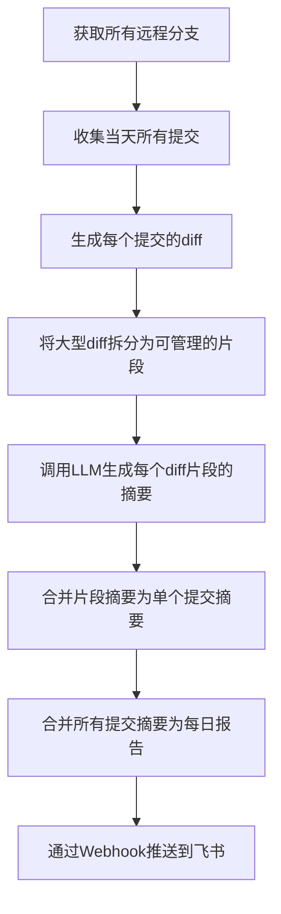

# Daily Commit Summarizer Go语言实现方案（优化版）

## 1. 项目概述

本文档提供了将 Daily Commit Summarizer 从 TypeScript 转换为 Go 语言的优化实现方案。该工具用于自动化收集、分析和总结 Git 仓库中的每日代码提交，并通过 AI 生成人类可读的摘要报告，最终通过飞书等平台推送给团队成员。

### 核心流程



## 2. 架构设计原则

本实现方案遵循以下架构设计原则：

1. **清晰的领域划分**：按业务功能划分模块，每个模块负责特定的领域。
2. **接口驱动设计**：通过接口定义模块间交互，降低耦合度。
3. **依赖注入**：通过构造函数注入依赖，便于单元测试和模块替换。
4. **单一职责原则**：每个结构体和函数只负责一个明确的任务。
5. **错误处理一致性**：统一的错误处理策略，提供有意义的错误信息。
6. **可测试性**：设计便于编写单元测试和集成测试的代码结构。
7. **配置外部化**：将配置与代码分离，支持多种配置来源。

## 3. 项目结构

```
├── cmd/
│   └── daily-summary/
│       └── main.go           # 主入口文件
├── internal/
│   ├── config/
│   │   ├── config.go         # 配置定义
│   │   └── loader.go         # 配置加载器
│   ├── git/
│   │   ├── collector.go      # Git收集器实现
│   │   ├── interfaces.go     # Git模块接口定义
│   │   └── models.go         # Git相关数据模型
│   ├── diff/
│   │   ├── processor.go      # Diff处理器实现
│   │   ├── interfaces.go     # Diff模块接口定义
│   │   └── models.go         # Diff相关数据模型
│   ├── llm/
│   │   ├── client.go         # LLM客户端实现
│   │   ├── interfaces.go     # LLM模块接口定义
│   │   └── models.go         # LLM相关数据模型
│   ├── prompt/
│   │   ├── builder.go        # 提示词构建器实现
│   │   └── interfaces.go     # 提示词模块接口定义
│   ├── notifier/
│   │   ├── interfaces.go     # 通知模块接口定义
│   │   ├── lark.go           # 飞书通知实现
│   │   └── models.go         # 通知相关数据模型
│   ├── app/
│   │   └── service.go        # 应用服务实现
│   └── utils/
│       ├── shell.go          # Shell命令工具
│       └── errors.go         # 错误处理工具
├── pkg/
│   └── logger/
│       └── logger.go         # 日志工具
├── test/
│   ├── mocks/                # 模拟对象
│   └── integration/          # 集成测试
├── go.mod                    # Go模块定义
└── go.sum                    # 依赖版本锁定
```

## 4. 模块设计与实现

### 4.1 配置模块

#### 接口定义

```go
// internal/config/interface.go
package config

import "context"

// ConfigLoader 配置加载器接口
type ConfigLoader interface {
	// Load 加载配置
	Load(ctx context.Context) (*Config, error)
	// Reload 重新加载配置
	Reload(ctx context.Context) (*Config, error)
	// Watch 监听配置变化
	Watch(ctx context.Context, callback func(*Config)) error
	// GetConfig 获取当前配置
	GetConfig() *Config
	// IsLoaded 检查配置是否已加载
	IsLoaded() bool
}

// ConfigValidator 配置验证器接口
type ConfigValidator interface {
	// Validate 验证配置
	Validate(config *Config) error
}

// ConfigProvider 配置提供者接口
type ConfigProvider interface {
	// GetConfig 获取当前配置
	GetConfig() *Config
	// IsLoaded 检查配置是否已加载
	IsLoaded() bool
}
```

#### 数据结构

```go
// internal/config/models.go

// Config 应用配置结构
type Config struct {
	// Git 配置
	Git GitConfig `json:"git" yaml:"git"`
	// LLM 配置
	LLM LLMConfig `json:"llm" yaml:"llm"`
	// 通知配置
	Notification NotificationConfig `json:"notification" yaml:"notification"`
	// 应用配置
	App AppConfig `json:"app" yaml:"app"`
	// 日志配置
	Logger LoggerConfig `json:"logger" yaml:"logger"`
}

// GitConfig Git相关配置
type GitConfig struct {
	// 仓库路径
	RepoPath string `json:"repo_path" yaml:"repo_path"`
	// 远程仓库名称
	RemoteName string `json:"remote_name" yaml:"remote_name"`
	// 默认分支
	DefaultBranch string `json:"default_branch" yaml:"default_branch"`
	// 排除的文件模式
	ExcludePatterns []string `json:"exclude_patterns" yaml:"exclude_patterns"`
	// 最大提交数量
	MaxCommits int `json:"max_commits" yaml:"max_commits"`
}

// LLMConfig LLM相关配置
type LLMConfig struct {
	// API密钥
	APIKey string `json:"api_key" yaml:"api_key"`
	// API基础URL
	BaseURL string `json:"base_url" yaml:"base_url"`
	// 模型名称
	Model string `json:"model" yaml:"model"`
	// 最大令牌数
	MaxTokens int `json:"max_tokens" yaml:"max_tokens"`
	// 温度参数
	Temperature float64 `json:"temperature" yaml:"temperature"`
	// 请求超时时间
	Timeout time.Duration `json:"timeout" yaml:"timeout"`
	// 重试次数
	RetryCount int `json:"retry_count" yaml:"retry_count"`
}

// NotificationConfig 通知相关配置
type NotificationConfig struct {
	// 飞书配置
	Lark LarkConfig `json:"lark" yaml:"lark"`
	// 是否启用通知
	Enabled bool `json:"enabled" yaml:"enabled"`
}

// LarkConfig 飞书通知配置
type LarkConfig struct {
	// Webhook URL
	WebhookURL string `json:"webhook_url" yaml:"webhook_url"`
	// 签名密钥
	Secret string `json:"secret" yaml:"secret"`
	// 超时时间
	Timeout time.Duration `json:"timeout" yaml:"timeout"`
}

// AppConfig 应用相关配置
type AppConfig struct {
	// 应用名称
	Name string `json:"name" yaml:"name"`
	// 应用版本
	Version string `json:"version" yaml:"version"`
	// 环境
	Environment string `json:"environment" yaml:"environment"`
	// 调试模式
	Debug bool `json:"debug" yaml:"debug"`
	// 工作目录
	WorkDir string `json:"work_dir" yaml:"work_dir"`
	// 数据目录
	DataDir string `json:"data_dir" yaml:"data_dir"`
}

// LoggerConfig 日志相关配置
type LoggerConfig struct {
	// 日志级别
	Level string `json:"level" yaml:"level"`
	// 日志格式 (json/text)
	Format string `json:"format" yaml:"format"`
	// 输出目标 (stdout/file)
	Output string `json:"output" yaml:"output"`
	// 日志文件路径
	FilePath string `json:"file_path" yaml:"file_path"`
	// 最大文件大小(MB)
	MaxSize int `json:"max_size" yaml:"max_size"`
	// 最大备份数量
	MaxBackups int `json:"max_backups" yaml:"max_backups"`
	// 最大保留天数
	MaxAge int `json:"max_age" yaml:"max_age"`
	// 是否压缩
	Compress bool `json:"compress" yaml:"compress"`
}
```

#### 实现

##### 配置加载器

```go
// internal/config/loader.go

// DefaultConfigLoader 默认配置加载器
type DefaultConfigLoader struct {
}

// NewDefaultConfigLoader 创建默认配置加载器
func NewDefaultConfigLoader(configPath string) *DefaultConfigLoader {
}

// Load 加载配置
func (l *DefaultConfigLoader) Load(ctx context.Context) (*Config, error) {
}

// Reload 重新加载配置
func (l *DefaultConfigLoader) Reload(ctx context.Context) (*Config, error) {
}

// Watch 监听配置变化
func (l *DefaultConfigLoader) Watch(ctx context.Context, callback func(*Config)) error {
}

// GetConfig 获取当前配置
func (l *DefaultConfigLoader) GetConfig() *Config {
}

// IsLoaded 检查配置是否已加载
func (l *DefaultConfigLoader) IsLoaded() bool {
}
```

##### 配置验证器

```go
// internal/config/validator.go
package config

import "fmt"

// DefaultConfigValidator 默认配置验证器
type DefaultConfigValidator struct{}

// Validate 验证配置
func (v *DefaultConfigValidator) Validate(config *Config) error {
	// 实现省略
	return nil
}
```

### 4.2 工具模块

```go
// internal/utils/shell.go
package utils

import (
	"os/exec"
	"strings"
)

// ShellExecutor 定义Shell命令执行器接口
type ShellExecutor interface {
	Execute(cmd string) (string, error)
}

// DefaultShellExecutor 默认Shell命令执行器
type DefaultShellExecutor struct{}

// NewShellExecutor 创建Shell命令执行器
func NewShellExecutor() ShellExecutor {
	return &DefaultShellExecutor{}
}

// Execute 执行shell命令并返回输出
func (e *DefaultShellExecutor) Execute(cmd string) (string, error) {
	command := exec.Command("sh", "-c", cmd)
	output, err := command.CombinedOutput()
	if err != nil {
		return "", err
	}
	return strings.TrimSpace(string(output)), nil
}
```

```go
// internal/utils/errors.go
package utils

import (
	"fmt"
	"time"
)

// RetryableFunc 定义可重试的函数类型
type RetryableFunc func() (interface{}, error)

// WithRetry 执行带重试的操作
func WithRetry(fn RetryableFunc, attempts int, delay time.Duration) (interface{}, error) {
	var err error
	var result interface{}
	
	for i := 0; i < attempts; i++ {
		result, err = fn()
		if err == nil {
			return result, nil
		}
		
		if i < attempts-1 {
			time.Sleep(delay)
		}
	}
	
	return nil, fmt.Errorf("failed after %d attempts: %w", attempts, err)
}
```

### 4.3 Git模块

#### 接口定义

```go
// internal/git/interfaces.go
package git

// Collector 定义Git收集器接口
type Collector interface {
	// FetchRemoteBranches 获取所有远程分支
	FetchRemoteBranches() ([]string, error)
	
	// CollectCommits 收集指定时间范围内的提交
	CollectCommits(since, until string) ([]CommitMeta, error)
}
```

#### 数据模型

```go
// internal/git/models.go
package git

// CommitMeta 存储提交的元数据
type CommitMeta struct {
	Sha      string
	Title    string
	Author   string
	URL      string
	Branches []string
}
```

#### 实现

```go
// internal/git/collector.go
package git

import (
	"fmt"
	"sort"
	"strings"
	
	"github.com/yourusername/daily-commit-summarizer/internal/config"
	"github.com/yourusername/daily-commit-summarizer/internal/utils"
	"github.com/yourusername/daily-commit-summarizer/pkg/logger"
)

// DefaultCollector 默认Git收集器实现
type DefaultCollector struct {
	config  *config.Config
	shell   utils.ShellExecutor
	logger  logger.Logger
}

// NewCollector 创建Git收集器
func NewCollector(config *config.Config, shell utils.ShellExecutor, logger logger.Logger) Collector {
	return &DefaultCollector{
		config: config,
		shell:  shell,
		logger: logger,
	}
}

// FetchRemoteBranches 获取所有远程分支
func (gc *DefaultCollector) FetchRemoteBranches() ([]string, error) {
	// 尝试获取所有远程分支
	_, err := gc.shell.Execute("git fetch --all --prune --tags")
	if err != nil {
		gc.logger.Warn("获取远程分支时出现警告，继续执行", "error", err)
	}

	// 列出所有origin/*远程分支，排除origin/HEAD
	cmd := `git for-each-ref --format="%(refname:short)" refs/remotes/origin | grep -v "^origin/HEAD$" || true`
	output, err := gc.shell.Execute(cmd)
	if err != nil {
		return nil, fmt.Errorf("获取远程分支列表失败: %w", err)
	}

	var branches []string
	for _, branch := range strings.Split(output, "\n") {
		branch = strings.TrimSpace(branch)
		if branch != "" {
			branches = append(branches, branch)
		}
	}

	return branches, nil
}

// CollectCommits 收集指定时间范围内的提交
func (gc *DefaultCollector) CollectCommits(since, until string) ([]CommitMeta, error) {
	// 获取远程分支
	remotelBranches, err := gc.FetchRemoteBranches()
	if err != nil {
		return nil, err
	}

	// 创建分支到提交的映射
	branchToCommits := make(map[string][]string)
	for _, rb := range remoteBranches {
		cmd := fmt.Sprintf(`git log %s --no-merges --since="%s" --until="%s" --pretty=format:%%H --reverse || true`, rb, since, until)
		output, err := gc.shell.Execute(cmd)
		if err != nil {
			gc.logger.Warn("获取分支提交时出现警告，跳过该分支", "branch", rb, "error", err)
			continue
		}

		var commits []string
		for _, commit := range strings.Split(output, "\n") {
			commit = strings.TrimSpace(commit)
			if commit != "" {
				commits = append(commits, commit)
			}
		}

		// 限制每个分支的提交数量
		if len(commits) > gc.config.PerBranchLimit {
			commits = commits[len(commits)-gc.config.PerBranchLimit:]
		}

		branchToCommits[rb] = commits
	}

	// 创建提交到分支的映射
	shaToBranches := make(map[string]map[string]bool)
	for rb, shas := range branchToCommits {
		for _, sha := range shas {
			if _, exists := shaToBranches[sha]; !exists {
				shaToBranches[sha] = make(map[string]bool)
			}
			shaToBranches[sha][rb] = true
		}
	}

	// 获取所有分支上的提交，按时间排序
	cmd := fmt.Sprintf(`git log --no-merges --since="%s" --until="%s" --all --pretty=format:%%H --reverse || true`, since, until)
	output, err := gc.shell.Execute(cmd)
	if err != nil {
		return nil, fmt.Errorf("获取所有提交失败: %w", err)
	}

	// 过滤并去重提交
	seen := make(map[string]bool)
	var commitShas []string
	for _, sha := range strings.Split(output, "\n") {
		sha = strings.TrimSpace(sha)
		if sha == "" {
			continue
		}

		if seen[sha] {
			continue
		}

		if _, exists := shaToBranches[sha]; !exists {
			continue
		}

		seen[sha] = true
		commitShas = append(commitShas, sha)
	}

	if len(commitShas) == 0 {
		return nil, nil // 没有有效提交
	}

	// 收集提交元数据
	serverURL := "https://github.com"
	var commitMetas []CommitMeta
	for _, sha := range commitShas {
		titleCmd := fmt.Sprintf("git show -s --format=%%s %s", sha)
		title, err := gc.shell.Execute(titleCmd)
		if err != nil {
			gc.logger.Warn("获取提交标题失败，跳过该提交", "sha", sha, "error", err)
			continue
		}

		authorCmd := fmt.Sprintf("git show -s --format=%%an %s", sha)
		author, err := gc.shell.Execute(authorCmd)
		if err != nil {
			gc.logger.Warn("获取提交作者失败，跳过该提交", "sha", sha, "error", err)
			continue
		}

		var url string
		if gc.config.Repo != "" {
			url = fmt.Sprintf("%s/%s/commit/%s", serverURL, gc.config.Repo, sha)
		} else {
			url = fmt.Sprintf("%s/commit/%s", serverURL, sha)
		}

		// 收集分支信息
		var branches []string
		for branch := range shaToBranches[sha] {
			branches = append(branches, branch)
		}
		sort.Strings(branches)

		commitMetas = append(commitMetas, CommitMeta{
			Sha:      sha,
			Title:    title,
			Author:   author,
			URL:      url,
			Branches: branches,
		})
	}

	return commitMetas, nil
}
```

### 4.4 Diff模块

#### 接口定义

```go
// internal/diff/interfaces.go
package diff

// Processor 定义Diff处理器接口
type Processor interface {
	// GetDiff 获取提交的代码差异
	GetDiff(sha string) (string, error)
	
	// SplitPatchByFile 将整个diff按文件拆分
	SplitPatchByFile(patch string) []string
	
	// ChunkBySize 将大型diff按大小拆分为多个片段
	ChunkBySize(parts []string, limit int) []string
}
```

#### 数据模型

```go
// internal/diff/models.go
package diff

// 排除的文件类型
var FileExcludes = []string{
	":!**/*.lock",
	":!**/dist/**",
	":!**/build/**",
	":!**/.next/**",
	":!**/.vite/**",
	":!**/out/**",
	":!**/coverage/**",
	":!package-lock.json",
	":!pnpm-lock.yaml",
	":!yarn.lock",
	":!**/*.min.*",
}
```

#### 实现

```go
// internal/diff/processor.go
package diff

import (
	"fmt"
	"regexp"
	"strings"
	
	"github.com/yourusername/daily-commit-summarizer/internal/config"
	"github.com/yourusername/daily-commit-summarizer/internal/utils"
	"github.com/yourusername/daily-commit-summarizer/pkg/logger"
)

// DefaultProcessor 默认Diff处理器实现
type DefaultProcessor struct {
	config *config.Config
	shell  utils.ShellExecutor
	logger logger.Logger
}

// NewProcessor 创建Diff处理器
func NewProcessor(config *config.Config, shell utils.ShellExecutor, logger logger.Logger) Processor {
	return &DefaultProcessor{
		config: config,
		shell:  shell,
		logger: logger,
	}
}

// GetParentSha 获取提交的父提交SHA
func (dp *DefaultProcessor) GetParentSha(sha string) (string, error) {
	cmd := fmt.Sprintf("git rev-list --parents -n 1 %s || true", sha)
	output, err := dp.shell.Execute(cmd)
	if err != nil {
		return "", fmt.Errorf("获取父提交SHA失败: %w", err)
	}

	parts := strings.Fields(output)
	if len(parts) > 1 {
		return parts[1], nil // 非merge情况parent通常只有一个
	}

	return "", nil // root commit无parent
}

// GetDiff 获取提交的代码差异
func (dp *DefaultProcessor) GetDiff(sha string) (string, error) {
	parent, err := dp.GetParentSha(sha)
	if err != nil {
		return "", err
	}

	var base string
	if parent != "" {
		base = parent
	} else {
		// 对于root commit，使用空树
		baseCmd := "git hash-object -t tree /dev/null"
		base, err = dp.shell.Execute(baseCmd)
		if err != nil {
			return "", fmt.Errorf("创建空树对象失败: %w", err)
		}
	}

	excludes := strings.Join(FileExcludes, " ")
	cmd := fmt.Sprintf("git diff --unified=0 --minimal %s %s -- . %s || true", base, sha, excludes)
	diff, err := dp.shell.Execute(cmd)
	if err != nil {
		return "", fmt.Errorf("获取diff失败: %w", err)
	}

	return diff, nil
}

// SplitPatchByFile 将整个diff按文件拆分
func (dp *DefaultProcessor) SplitPatchByFile(patch string) []string {
	if patch == "" {
		return []string{}
	}

	// 使用正则表达式按文件拆分diff
	re := regexp.MustCompile(`(?m)^diff --git.*$`)
	parts := re.Split(patch, -1)

	var result []string
	for _, part := range parts {
		part = strings.TrimSpace(part)
		if part != "" {
			result = append(result, part)
		}
	}

	return result
}

// ChunkBySize 将大型diff按大小拆分为多个片段
func (dp *DefaultProcessor) ChunkBySize(parts []string, limit int) []string {
	if limit <= 0 {
		limit = dp.config.DiffChunkMaxChars
	}

	var out []string
	buf := ""

	for _, p := range parts {
		var candidate string
		if buf != "" {
			candidate = buf + "\n\n" + p
		} else {
			candidate = p
		}

		if len(candidate) > limit {
			if buf != "" {
				out = append(out, buf)
			}

			if len(p) > limit {
				// 如果单个部分超过限制，按字符数切分
				for i := 0; i < len(p); i += limit {
					end := i + limit
					if end > len(p) {
						end = len(p)
					}
					out = append(out, p[i:end])
				}
				buf = ""
			} else {
				buf = p
			}
		} else {
			buf = candidate
		}
	}

	if buf != "" {
		out = append(out, buf)
	}

	return out
}
```

### 4.5 LLM模块

#### 接口定义

```go
// internal/llm/interfaces.go
package llm

// Client 定义LLM客户端接口
type Client interface {
	// Chat 发送提示词到LLM API并获取响应
	Chat(prompt string) (string, error)
}
```

#### 数据模型

```go
// internal/llm/models.go
package llm

// ChatMessage 表示聊天消息
type ChatMessage struct {
	Role    string `json:"role"`
	Content string `json:"content"`
}

// ChatPayload 表示LLM API请求负载
type ChatPayload struct {
	Model       string        `json:"model"`
	Messages    []ChatMessage `json:"messages"`
	Temperature float64       `json:"temperature,omitempty"`
}

// ChatResponse 表示LLM API响应
type ChatResponse struct {
	Choices []struct {
		Message struct {
			Content string `json:"content"`
		} `json:"message"`
	} `json:"choices"`
}
```

#### 实现

```go
// internal/llm/client.go
package llm

import (
	"bytes"
	"encoding/json"
	"fmt"
	"io/ioutil"
	"net/http"
	"net/url"
	"strings"
	"time"
	
	"github.com/yourusername/daily-commit-summarizer/internal/config"
	"github.com/yourusername/daily-commit-summarizer/internal/utils"
	"github.com/yourusername/daily-commit-summarizer/pkg/logger"
)

// OpenAIClient 处理与OpenAI API的交互
type OpenAIClient struct {
	config     *config.Config
	httpClient *http.Client
	logger     logger.Logger
}

// NewOpenAIClient 创建OpenAI客户端
func NewOpenAIClient(config *config.Config, logger logger.Logger) Client {
	return &OpenAIClient{
		config: config,
		httpClient: &http.Client{
			Timeout: 30 * time.Second,
		},
		logger: logger,
	}
}

// Chat 发送提示词到OpenAI API并获取响应
func (oc *OpenAIClient) Chat(prompt string) (string, error) {
	// 使用重试机制
	result, err := utils.WithRetry(
		func() (interface{}, error) {
			return oc.doChat(prompt)
		},
		oc.config.RetryAttempts,
		oc.config.RetryDelay,
	)
	
	if err != nil {
		return "", err
	}
	
	return result.(string), nil
}

// doChat 执行实际的API调用
func (oc *OpenAIClient) doChat(prompt string) (string, error) {
	payload := ChatPayload{
		Model: oc.config.ModelName,
		Messages: []ChatMessage{
			{Role: "user", Content: prompt},
		},
		Temperature: 0.2,
	}

	payloadBytes, err := json.Marshal(payload)
	if err != nil {
		return "", fmt.Errorf("序列化请求负载失败: %w", err)
	}

	// 解析API URL
	baseURL, err := url.Parse(oc.config.OpenAIBaseURL)
	if err != nil {
		return "", fmt.Errorf("解析API URL失败: %w", err)
	}

	// 构建请求路径
	path := fmt.Sprintf("/openai/deployments/%s/chat/completions?api-version=2024-12-01-preview", oc.config.ModelName)
	baseURL.Path = path

	// 创建HTTP请求
	req, err := http.NewRequest("POST", baseURL.String(), bytes.NewBuffer(payloadBytes))
	if err != nil {
		return "", fmt.Errorf("创建HTTP请求失败: %w", err)
	}

	// 设置请求头
	req.Header.Set("Content-Type", "application/json")
	req.Header.Set("Authorization", "Bearer "+oc.config.OpenAIAPIKey)

	// 发送请求
	resp, err := oc.httpClient.Do(req)
	if err != nil {
		return "", fmt.Errorf("发送HTTP请求失败: %w", err)
	}
	defer resp.Body.Close()

	// 读取响应
	body, err := ioutil.ReadAll(resp.Body)
	if err != nil {
		return "", fmt.Errorf("读取响应失败: %w", err)
	}

	// 检查响应状态
	if resp.StatusCode < 200 || resp.StatusCode >= 300 {
		return "", fmt.Errorf("OpenAI HTTP %d: %s", resp.StatusCode, string(body))
	}

	// 解析响应
	var response ChatResponse
	if err := json.Unmarshal(body, &response); err != nil {
		return "", fmt.Errorf("解析响应失败: %w", err)
	}

	// 提取内容
	if len(response.Choices) > 0 {
		return strings.TrimSpace(response.Choices[0].Message.Content), nil
	}

	return "", fmt.Errorf("响应中没有内容")
}
```

### 4.6 提示词模块

#### 接口定义

```go
// internal/prompt/interfaces.go
package prompt

import (
	"github.com/yourusername/daily-commit-summarizer/internal/git"
)

// Builder 定义提示词构建器接口
type Builder interface {
	// CommitChunkPrompt 为单个diff片段构建提示词
	CommitChunkPrompt(meta git.CommitMeta, partIdx, total int, patch string) string
	
	// CommitMergePrompt 为合并多个diff片段的摘要构建提示词
	CommitMergePrompt(meta git.CommitMeta, parts []string) string
	
	// DailyMergePrompt 为生成每日报告构建提示词
	DailyMergePrompt(dateLabel string, items []CommitSummary, repo string) string
}

// CommitSummary 存储提交摘要
type CommitSummary struct {
	Meta    git.CommitMeta
	Summary string
}
```

#### 实现

```go
// internal/prompt/builder.go
package prompt

import (
	"fmt"
	"strings"
	
	"github.com/yourusername/daily-commit-summarizer/internal/git"
)

// DefaultBuilder 默认提示词构建器实现
type DefaultBuilder struct{}

// NewBuilder 创建提示词构建器
func NewBuilder() Builder {
	return &DefaultBuilder{}
}

// CommitChunkPrompt 为单个diff片段构建提示词
func (pb *DefaultBuilder) CommitChunkPrompt(meta git.CommitMeta, partIdx, total int, patch string) string {
	return fmt.Sprintf(`你是一名资深工程师与发布经理。以下是提交 %s（%s）的 diff 片段（第 %d/%d 段），请用中文输出结构化摘要：

提交信息：
- SHA: %s
- 标题: %s
- 作者: %s
- 分支: %s
- 链接: %s

要求输出：
1) 变更要点（面向工程师与产品）：列出此片段涉及的主要改动与意图
2) 影响范围：模块/接口/关键文件
3) 风险&回滚点
4) 测试建议
注意：仅基于当前片段，不要臆测；不要贴长代码；如果只是格式化/重命名也请明确指出。

=== DIFF PART BEGIN ===
%s
=== DIFF PART END ===`,
		meta.Sha[:7], meta.Title, partIdx, total, meta.Sha, meta.Title, meta.Author,
		strings.Join(meta.Branches, ", "), meta.URL, patch)
}

// CommitMergePrompt 为合并多个diff片段的摘要构建提示词
func (pb *DefaultBuilder) CommitMergePrompt(meta git.CommitMeta, parts []string) string {
	var joinedParts strings.Builder
	for i, p := range parts {
		if i > 0 {
			joinedParts.WriteString("\n\n")
		}
		joinedParts.WriteString(fmt.Sprintf("【片段%d】\n%s", i+1, p))
	}

	return fmt.Sprintf(`下面是提交 %s 的各片段小结，请合并为**单条提交**的最终摘要（中文），输出以下小节：
- 变更概述（不超过5条要点）
- 影响范围（模块/接口/配置）
- 风险与回滚点
- 测试建议
- 面向用户的可见影响（如有）

请避免重复、合并同类项，标注"可能不完整"当某些片段缺失或被截断。

=== 片段小结集合 BEGIN ===
%s
=== 片段小结集合 END ===`,
		meta.Sha[:7], joinedParts.String())
}

// DailyMergePrompt 为生成每日报告构建提示词
func (pb *DefaultBuilder) DailyMergePrompt(dateLabel string, items []CommitSummary, repo string) string {
	var body strings.Builder
	for i, item := range items {
		if i > 0 {
			body.WriteString("\n\n---\n\n")
		}
		body.WriteString(fmt.Sprintf("[%s] %s — %s — %s\n%s",
			item.Meta.Sha[:7], item.Meta.Title, item.Meta.Author,
			strings.Join(item.Meta.Branches, ", "), item.Summary))
	}

	return fmt.Sprintf(`请将以下"当日各提交摘要"整合成**当日开发变更日报（中文）**，输出结构如下：
# %s 开发变更日报（%s)
1. 今日概览（不超过5条）
2. **按分支**的关键改动清单（每条含模块/影响、是否潜在破坏性）
3. 跨分支风险与回滚策略（如同一提交在多个分支、存在 cherry-pick/divergence）
4. 建议测试与验证清单
5. 其他备注（如重构/依赖升级/仅格式化）

=== 当日提交摘要 BEGIN ===
%s
=== 当日提交摘要 END ===`,
		dateLabel, repo, body.String())
}
```

### 4.7 通知模块

#### 接口定义

```go
// internal/notifier/interfaces.go
package notifier

// Notifier 定义通知器接口
type Notifier interface {
	// Send 发送消息
	Send(text string) error
}
```

#### 实现

```go
// internal/notifier/lark.go
package notifier

import (
	"bytes"
	"encoding/json"
	"fmt"
	"net/http"
	"net/url"
	"time"
	
	"github.com/yourusername/daily-commit-summarizer/internal/config"
	"github.com/yourusername/daily-commit-summarizer/internal/utils"
	"github.com/yourusername/daily-commit-summarizer/pkg/logger"
)

// LarkNotifier 处理飞书通知
type LarkNotifier struct {
	config     *config.Config
	httpClient *http.Client
	logger     logger.Logger
}

// NewLarkNotifier 创建飞书通知器
func NewLarkNotifier(config *config.Config, logger logger.Logger) Notifier {
	return &LarkNotifier{
		config: config,
		httpClient: &http.Client{
			Timeout: 10 * time.Second,
		},
		logger: logger,
	}
}

// Send 发送消息到飞书
func (ln *LarkNotifier) Send(text string) error {
	if ln.config.LarkWebhookURL == "" {
		ln.logger.Info("LARK_WEBHOOK_URL 未配置，以下为最终日报文本：\n\n" + text)
		return nil
	}

	// 使用重试机制
	_, err := utils.WithRetry(
		func() (interface{}, error) {
			return nil, ln.doSend(text)
		},
		ln.config.RetryAttempts,
		ln.config.RetryDelay,
	)
	
	return err
}

// doSend 执行实际的发送操作
func (ln *LarkNotifier) doSend(text string) error {
	// 构建请求负载
	payload := map[string]interface{}{
		"msg_type": "text",
		"content": map[string]string{
			"text": text,
		},
	}

	payloadBytes, err := json.Marshal(payload)
	if err != nil {
		return fmt.Errorf("序列化请求负载失败: %w", err)
	}

	// 解析Webhook URL
	webhookURL, err := url.Parse(ln.config.LarkWebhookURL)
	if err != nil {
		return fmt.Errorf("解析Webhook URL失败: %w", err)
	}

	// 创建HTTP请求
	req, err := http.NewRequest("POST", webhookURL.String(), bytes.NewBuffer(payloadBytes))
	if err != nil {
		return fmt.Errorf("创建HTTP请求失败: %w", err)
	}

	// 设置请求头
	req.Header.Set("Content-Type", "application/json")

	// 发送请求
	resp, err := ln.httpClient.Do(req)
	if err != nil {
		return fmt.Errorf("发送HTTP请求失败: %w", err)
	}
	defer resp.Body.Close()

	// 检查响应状态
	if resp.StatusCode < 200 || resp.StatusCode >= 300 {
		return fmt.Errorf("飞书Webhook HTTP %d", resp.StatusCode)
	}

	return nil
}
```

### 4.8 应用服务模块

```go
// internal/app/service.go
package app

import (
	"fmt"
	"strings"
	"sync"
	"time"
	
	"github.com/yourusername/daily-commit-summarizer/internal/config"
	"github.com/yourusername/daily-commit-summarizer/internal/diff"
	"github.com/yourusername/daily-commit-summarizer/internal/git"
	"github.com/yourusername/daily-commit-summarizer/internal/llm"
	"github.com/yourusername/daily-commit-summarizer/internal/notifier"
	"github.com/yourusername/daily-commit-summarizer/internal/prompt"
	"github.com/yourusername/daily-commit-summarizer/pkg/logger"
)

// Service 应用服务
type Service struct {
	config     *config.Config
	git        git.Collector
	diff       diff.Processor
	llm        llm.Client
	prompt     prompt.Builder
	notifier   notifier.Notifier
	logger     logger.Logger
}

// NewService 创建应用服务
func NewService(
	config *config.Config,
	git git.Collector,
	diff diff.Processor,
	llm llm.Client,
	prompt prompt.Builder,
	notifier notifier.Notifier,
	logger logger.Logger,
) *Service {
	return &Service{
		config:   config,
		git:      git,
		diff:     diff,
		llm:      llm,
		prompt:   prompt,
		notifier: notifier,
		logger:   logger,
	}
}

// Run 运行应用服务
func (s *Service) Run() error {
	// 设置时间范围
	since := "midnight" // 受TZ环境变量影响
	until := "now"

	// 收集提交
	s.logger.Info("开始收集提交", "since", since, "until", until)
	commitMetas, err := s.git.CollectCommits(since, until)
	if err != nil {
		return fmt.Errorf("收集提交失败: %w", err)
	}

	if len(commitMetas) == 0 {
		s.logger.Info("📭 今天所有分支均无有效提交。结束。")
		return nil
	}

	s.logger.Info("收集到提交", "count", len(commitMetas))

	// 处理每个提交
	perCommitFinal := s.processCommitsInParallel(commitMetas)

	// 生成当地日期标签
	todayLabel := time.Now().In(s.config.TimeZone).Format("2006-01-02")

	// 汇总当日总览
	var items []prompt.CommitSummary
	for _, item := range perCommitFinal {
		items = append(items, item)
	}

	repo := s.config.Repo
	if repo == "" {
		repo = "repository"
	}

	s.logger.Info("生成每日报告")
	promptText := s.prompt.DailyMergePrompt(todayLabel, items, repo)
	daily, err := s.llm.Chat(promptText)
	if err != nil {
		s.logger.Error("生成每日报告失败，使用简单拼接", "error", err)
		// 如果汇总失败，则简单拼接
		var sb strings.Builder
		sb.WriteString("（当日汇总失败，以下为逐提交原始小结拼接）\n\n")

		for i, item := range perCommitFinal {
			if i > 0 {
				sb.WriteString("\n\n---\n\n")
			}
			sb.WriteString(fmt.Sprintf("[%s] %s — %s\n%s",
				item.Meta.Sha[:7], item.Meta.Title, strings.Join(item.Meta.Branches, ", "), item.Summary))
		}

		daily = sb.String()
	}

	// 发送飞书
	s.logger.Info("发送飞书通知")
	if err := s.notifier.Send(daily); err != nil {
		return fmt.Errorf("发送飞书通知失败: %w", err)
	}

	s.logger.Info("✅ 已发送飞书日报。")
	return nil
}

// processCommitsInParallel 并行处理提交
func (s *Service) processCommitsInParallel(commitMetas []git.CommitMeta) []prompt.CommitSummary {
	results := make([]prompt.CommitSummary, len(commitMetas))
	wg := sync.WaitGroup{}
	semaphore := make(chan struct{}, s.config.MaxConcurrency) // 限制最大并发数
	mutex := sync.Mutex{}
	
	for i, meta := range commitMetas {
		wg.Add(1)
		semaphore <- struct{}{} // 获取信号量
		
		go func(i int, meta git.CommitMeta) {
			defer wg.Done()
			defer func() { <-semaphore }() // 释放信号量
			
			// 处理单个提交
			summary := s.processCommit(meta)
			
			// 线程安全地更新结果
			mutex.Lock()
			results[i] = summary
			mutex.Unlock()
		}(i, meta)
	}
	
	wg.Wait()
	return results
}

// processCommit 处理单个提交
func (s *Service) processCommit(meta git.CommitMeta) prompt.CommitSummary {
	s.logger.Info("处理提交", "sha", meta.Sha[:7], "title", meta.Title)
	
	// 获取diff
	fullPatch, err := s.diff.GetDiff(meta.Sha)
	if err != nil {
		s.logger.Error("获取diff失败", "sha", meta.Sha[:7], "error", err)
		return prompt.CommitSummary{
			Meta:    meta,
			Summary: fmt.Sprintf("（获取diff失败：%s）", err.Error()),
		}
	}

	if fullPatch == "" || strings.TrimSpace(fullPatch) == "" {
		s.logger.Info("提交无有效业务改动", "sha", meta.Sha[:7])
		return prompt.CommitSummary{
			Meta:    meta,
			Summary: "（无有效业务改动或改动已被过滤，例如 lockfile/构建产物/二进制，或空提交）",
		}
	}

	// 分片diff
	fileParts := s.diff.SplitPatchByFile(fullPatch)
	chunks := s.diff.ChunkBySize(fileParts, s.config.DiffChunkMaxChars)
	s.logger.Info("diff分片完成", "sha", meta.Sha[:7], "chunks", len(chunks))

	// 为每个片段生成摘要
	partSummaries := s.processChunksInParallel(meta, chunks)

	// 合并为单提交摘要
	promptText := s.prompt.CommitMergePrompt(meta, partSummaries)
	merged, err := s.llm.Chat(promptText)
	if err != nil {
		s.logger.Error("合并片段摘要失败，使用简单拼接", "sha", meta.Sha[:7], "error", err)
		merged = strings.Join(partSummaries, "\n\n")
	}

	return prompt.CommitSummary{
		Meta:    meta,
		Summary: merged,
	}
}

// processChunksInParallel 并行处理diff片段
func (s *Service) processChunksInParallel(meta git.CommitMeta, chunks []string) []string {
	results := make([]string, len(chunks))
	wg := sync.WaitGroup{}
	semaphore := make(chan struct{}, s.config.MaxConcurrency) // 限制最大并发数
	mutex := sync.Mutex{}
	
	for i, chunk := range chunks {
		wg.Add(1)
		semaphore <- struct{}{} // 获取信号量
		
		go func(i int, chunk string) {
			defer wg.Done()
			defer func() { <-semaphore }() // 释放信号量
			
			// 处理单个片段
			promptText := s.prompt.CommitChunkPrompt(meta, i+1, len(chunks), chunk)
			sum, err := s.llm.Chat(promptText)
			
			var result string
			if err != nil {
				s.logger.Error("生成片段摘要失败", "sha", meta.Sha[:7], "chunk", i+1, "error", err)
				result = fmt.Sprintf("（片段%d调用失败：%s）", i+1, err.Error())
			} else if sum == "" {
				result = fmt.Sprintf("（片段%d摘要为空）", i+1)
			} else {
				result = sum
			}
			
			// 线程安全地更新结果
			mutex.Lock()
			results[i] = result
			mutex.Unlock()
		}(i, chunk)
	}
	
	wg.Wait()
	return results
}
```

### 4.9 日志模块

```go
// pkg/logger/logger.go
package logger

import (
	"fmt"
	"log"
	"os"
	"time"
)

// Logger 定义日志接口
type Logger interface {
	Debug(msg string, keysAndValues ...interface{})
	Info(msg string, keysAndValues ...interface{})
	Warn(msg string, keysAndValues ...interface{})
	Error(msg string, keysAndValues ...interface{})
}

// Level 日志级别
type Level int

const (
	DebugLevel Level = iota
	InfoLevel
	WarnLevel
	ErrorLevel
)

// DefaultLogger 默认日志实现
type DefaultLogger struct {
	level  Level
	logger *log.Logger
}

// NewLogger 创建日志器
func NewLogger(level Level) Logger {
	return &DefaultLogger{
		level:  level,
		logger: log.New(os.Stdout, "", 0),
	}
}

// formatLog 格式化日志
func (l *DefaultLogger) formatLog(level, msg string, keysAndValues ...interface{}) string {
	timestamp := time.Now().Format("2006-01-02 15:04:05")
	base := fmt.Sprintf("%s [%s] %s", timestamp, level, msg)
	
	// 处理键值对
	if len(keysAndValues) > 0 {
		var pairs []string
		for i := 0; i < len(keysAndValues); i += 2 {
			if i+1 < len(keysAndValues) {
				key := fmt.Sprintf("%v", keysAndValues[i])
				value := fmt.Sprintf("%v", keysAndValues[i+1])
				pairs = append(pairs, fmt.Sprintf("%s=%s", key, value))
			}
		}
		if len(pairs) > 0 {
			base += " " + fmt.Sprintf("[%s]", fmt.Sprintf("%s", pairs))
		}
	}
	
	return base
}

// Debug 输出调试日志
func (l *DefaultLogger) Debug(msg string, keysAndValues ...interface{}) {
	if l.level <= DebugLevel {
		l.logger.Println(l.formatLog("DEBUG", msg, keysAndValues...))
	}
}

// Info 输出信息日志
func (l *DefaultLogger) Info(msg string, keysAndValues ...interface{}) {
	if l.level <= InfoLevel {
		l.logger.Println(l.formatLog("INFO", msg, keysAndValues...))
	}
}

// Warn 输出警告日志
func (l *DefaultLogger) Warn(msg string, keysAndValues ...interface{}) {
	if l.level <= WarnLevel {
		l.logger.Println(l.formatLog("WARN", msg, keysAndValues...))
	}
}

// Error 输出错误日志
func (l *DefaultLogger) Error(msg string, keysAndValues ...interface{}) {
	if l.level <= ErrorLevel {
		l.logger.Println(l.formatLog("ERROR", msg, keysAndValues...))
	}
}
```

## 5. 主程序入口

```go
// cmd/daily-summary/main.go
package main

import (
	"log"
	"os"
	
	"github.com/yourusername/daily-commit-summarizer/internal/app"
	"github.com/yourusername/daily-commit-summarizer/internal/config"
	"github.com/yourusername/daily-commit-summarizer/internal/diff"
	"github.com/yourusername/daily-commit-summarizer/internal/git"
	"github.com/yourusername/daily-commit-summarizer/internal/llm"
	"github.com/yourusername/daily-commit-summarizer/internal/notifier"
	"github.com/yourusername/daily-commit-summarizer/internal/prompt"
	"github.com/yourusername/daily-commit-summarizer/internal/utils"
	"github.com/yourusername/daily-commit-summarizer/pkg/logger"
)

func main() {
	// 创建日志器
	logger := logger.NewLogger(logger.InfoLevel)
	
	// 加载配置
	configLoader := config.NewEnvLoader()
	cfg, err := configLoader.Load()
	if err != nil {
		log.Fatalf("加载配置失败: %v", err)
	}
	
	// 验证配置
	if err := cfg.Validate(); err != nil {
		log.Fatalf("配置验证失败: %v", err)
	}
	
	// 创建依赖
	shell := utils.NewShellExecutor()
	gitCollector := git.NewCollector(cfg, shell, logger)
	diffProcessor := diff.NewProcessor(cfg, shell, logger)
	llmClient := llm.NewOpenAIClient(cfg, logger)
	promptBuilder := prompt.NewBuilder()
	notifier := notifier.NewLarkNotifier(cfg, logger)
	
	// 创建应用服务
	service := app.NewService(
		cfg,
		gitCollector,
		diffProcessor,
		llmClient,
		promptBuilder,
		notifier,
		logger,
	)
	
	// 运行服务
	if err := service.Run(); err != nil {
		logger.Error("服务运行失败", "error", err)
		os.Exit(1)
	}
}
```

## 6. 依赖管理

```go
// go.mod
module github.com/yourusername/daily-commit-summarizer

go 1.21

require (
	// 无外部依赖，仅使用标准库
)
```

## 7. 测试示例

```go
// test/mocks/git_mock.go
package mocks

import (
	"github.com/yourusername/daily-commit-summarizer/internal/git"
)

// MockGitCollector 模拟Git收集器
type MockGitCollector struct {
	Commits []git.CommitMeta
	Error   error
}

// FetchRemoteBranches 模拟获取远程分支
func (m *MockGitCollector) FetchRemoteBranches() ([]string, error) {
	if m.Error != nil {
		return nil, m.Error
	}
	return []string{"origin/main", "origin/develop"}, nil
}

// CollectCommits 模拟收集提交
func (m *MockGitCollector) CollectCommits(since, until string) ([]git.CommitMeta, error) {
	if m.Error != nil {
		return nil, m.Error
	}
	return m.Commits, nil
}
```

```go
// test/integration/service_test.go
package integration

import (
	"testing"
	
	"github.com/yourusername/daily-commit-summarizer/internal/app"
	"github.com/yourusername/daily-commit-summarizer/internal/config"
	"github.com/yourusername/daily-commit-summarizer/internal/git"
	"github.com/yourusername/daily-commit-summarizer/pkg/logger"
	"github.com/yourusername/daily-commit-summarizer/test/mocks"
)

func TestServiceRun(t *testing.T) {
	// 创建测试配置
	cfg := &config.Config{
		OpenAIAPIKey:      "test-key",
		ModelName:         "gpt-4",
		PerBranchLimit:    10,
		DiffChunkMaxChars: 1000,
		MaxConcurrency:    2,
		RetryAttempts:     1,
	}
	
	// 创建模拟对象
	mockGit := &mocks.MockGitCollector{
		Commits: []git.CommitMeta{
			{
				Sha:      "abc123",
				Title:    "测试提交",
				Author:   "测试用户",
				Branches: []string{"origin/main"},
			},
		},
	}
	
	// 创建日志器
	logger := logger.NewLogger(logger.InfoLevel)
	
	// 这里可以继续添加其他模拟对象和测试逻辑
	// ...
}
```

## 8. 部署说明

### 8.1 构建

```bash
# 构建二进制文件
go build -o daily-summary cmd/daily-summary/main.go

# 交叉编译（如果需要）
GOOS=linux GOARCH=amd64 go build -o daily-summary-linux cmd/daily-summary/main.go
```

### 8.2 环境变量配置

```bash
# 必需配置
export OPENAI_API_KEY="your-openai-api-key"
export LARK_WEBHOOK_URL="your-lark-webhook-url"
export REPO="your-org/your-repo"

# 可选配置
export OPENAI_BASE_URL="https://api.openai.com"
export MODEL_NAME="gpt-4.1-mini"
export PER_BRANCH_LIMIT="200"
export DIFF_CHUNK_MAX_CHARS="80000"
export MAX_CONCURRENCY="5"
export RETRY_ATTEMPTS="3"
export RETRY_DELAY="1s"
export TZ="Asia/Shanghai"
```

### 8.3 定时任务

```bash
# 添加到 crontab
# 每天早上9点执行
0 9 * * * cd /path/to/your/repo && /path/to/daily-summary
```

## 9. 优化建议

1. **性能优化**：
   - 使用连接池管理HTTP连接
   - 实现更智能的diff分片算法
   - 添加缓存机制避免重复处理

2. **可靠性提升**：
   - 添加更详细的错误分类和处理
   - 实现断点续传机制
   - 添加健康检查和监控

3. **功能扩展**：
   - 支持多种LLM提供商
   - 支持多种通知渠道
   - 添加Web界面进行配置管理

4. **代码质量**：
   - 增加单元测试覆盖率
   - 添加集成测试
   - 使用静态分析工具

## 10. 总结

本Go语言实现方案提供了一个清晰、可维护、可扩展的架构，通过模块化设计和接口驱动的方式，确保了代码的可测试性和可替换性。相比TypeScript版本，Go版本具有更好的性能、更小的部署包大小和更简单的依赖管理。

主要优势：
- **性能优越**：Go的并发模型和编译优化
- **部署简单**：单一二进制文件，无需运行时环境
- **内存效率**：更低的内存占用
- **类型安全**：编译时类型检查
- **并发支持**：原生的goroutine和channel支持

该实现方案为Daily Commit Summarizer提供了一个坚实的技术基础，能够满足当前需求并为未来扩展提供良好的架构支撑。
	
