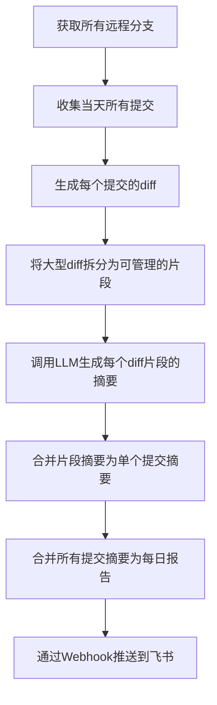
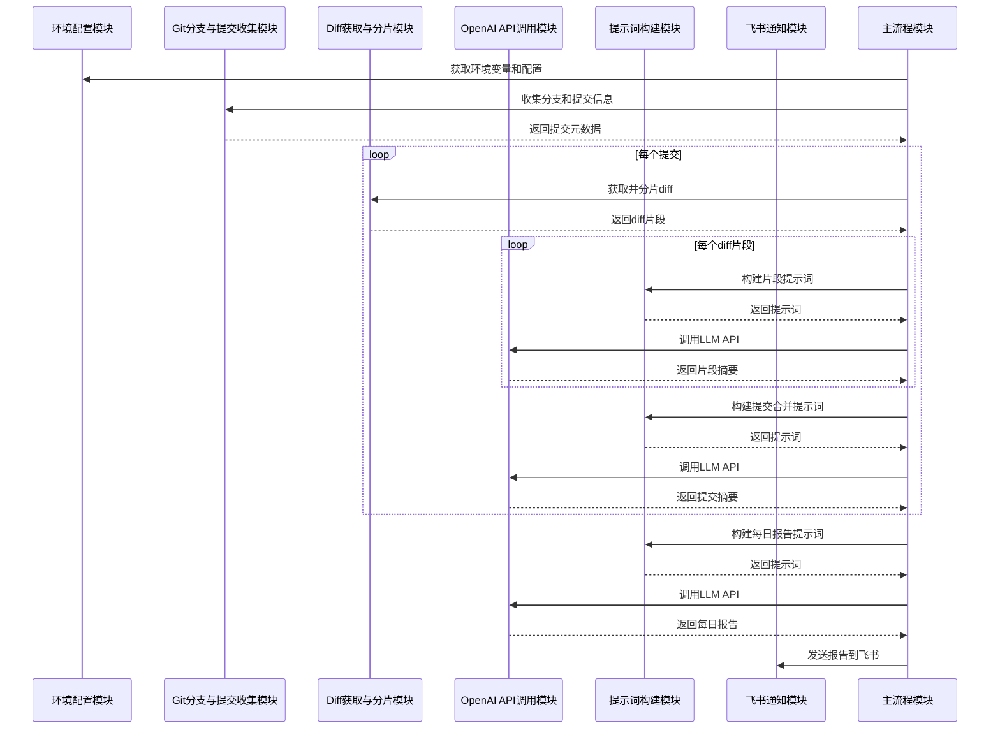

# Daily Commit Summarizer 业务逻辑分析

## 1. 功能概述

这个项目是一个自动化工具，用于汇总和分析Git仓库中的每日代码提交，并通过AI生成人类可读的摘要报告，最终通过飞书等平台推送给团队成员。

主要解决的业务需求是：帮助软件团队快速了解代码库中每天发生的变更，而无需逐一查看冗长的git log或大型PR。

### 核心逻辑流程图



## 2. 模块级拆解

### 模块A：环境配置与初始化

- 概述业务意义：设置必要的环境变量和参数，为后续操作提供配置基础

#### 逻辑块 1
**代码片段：**
```typescript
// ------- 环境变量 -------
const OPENAI_BASE_URL = process.env.OPENAI_BASE_URL || "https://api.openai.com";
const OPENAI_API_KEY = process.env.OPENAI_API_KEY || "";
const LARK_WEBHOOK_URL = process.env.LARK_WEBHOOK_URL || "";
const REPO = process.env.REPO || ""; // e.g. "org/repo"
const MODEL_NAME = process.env.MODEL_NAME || "gpt-4.1-mini";
const PER_BRANCH_LIMIT = parseInt(process.env.PER_BRANCH_LIMIT || "200", 10);
const DIFF_CHUNK_MAX_CHARS = parseInt(
  process.env.DIFF_CHUNK_MAX_CHARS || "80000",
  10,
);
```
**解释**：
- 定义关键环境变量，包括OpenAI API的URL和密钥、飞书Webhook地址、仓库名称等
- 设置默认值和可配置参数，如模型名称、每个分支的提交限制、diff片段大小限制等
- 这些配置项使工具具有灵活性，可以根据不同团队的需求进行调整

#### 逻辑块 2
**代码片段：**
```typescript
if (!OPENAI_API_KEY) {
  console.error("Missing OPENAI_API_KEY");
  process.exit(1);
}

// ------- 工具函数 -------
function sh(cmd: string) {
  return execSync(cmd, {
    stdio: ["ignore", "pipe", "pipe"],
    encoding: "utf8",
  }).trim();
}

function safeArray<T>(xs: T[] | undefined | null) {
  return Array.isArray(xs) ? xs : [];
}
```
**解释**：
- 验证必要的环境变量（如OpenAI API密钥）是否存在，确保程序能正常运行
- 定义工具函数，如`sh`用于执行shell命令并获取输出，`safeArray`用于安全处理数组
- 这些辅助函数为后续的Git操作和数据处理提供基础支持

### 模块B：Git分支与提交收集

- 概述业务意义：从Git仓库中获取所有远程分支和当天的提交信息，为后续分析提供数据基础

#### 逻辑块 1
**代码片段：**
```typescript
const since = "midnight"; // 受 TZ=America/Los_Angeles 影响
const until = "now";

// 拉全远端（建议在 workflow 里执行：git fetch --all --prune --tags）
// 这里再次保险 fetch 一次，避免本地调试遗漏
try {
  sh(`git fetch --all --prune --tags`);
} catch {
  // ignore
}

// 列出所有 origin/* 远端分支，排除 origin/HEAD
const remoteBranches = sh(
  `git for-each-ref --format="%(refname:short)" refs/remotes/origin | grep -v "^origin/HEAD$" || true`,
)
  .split("\n")
  .map((s) => s.trim())
  .filter(Boolean);
```
**解释**：
- 设置时间范围参数，用于筛选当天的提交（从午夜到现在）
- 执行`git fetch`命令，确保获取所有远程分支的最新状态
- 列出所有远程分支（origin/*），并排除origin/HEAD，为后续收集提交做准备
- 这一步骤确保了工具能够全面覆盖所有分支上的变更

#### 逻辑块 2
**代码片段：**
```typescript
type CommitMeta = {
  sha: string;
  title: string;
  author: string;
  url: string;
  branches: string[]; // 该提交归属的分支集合
};

const branchToCommits = new Map<string, string[]>();
for (const rb of remoteBranches) {
  const list = sh(
    `git log ${rb} --no-merges --since="${since}" --until="${until}" --pretty=format:%H --reverse || true`,
  )
    .split("\n")
    .map((s) => s.trim())
    .filter(Boolean);
  branchToCommits.set(rb, list.slice(-PER_BRANCH_LIMIT));
}
```
**解释**：
- 定义`CommitMeta`类型，用于存储提交的元数据，包括SHA、标题、作者、URL和所属分支
- 创建`branchToCommits`映射，记录每个分支上的提交
- 遍历所有远程分支，使用`git log`命令获取每个分支上当天的提交（不包括合并提交）
- 限制每个分支最多收集`PER_BRANCH_LIMIT`条提交，避免处理过多数据

#### 逻辑块 3
**代码片段：**
```typescript
// 反向映射：提交 → 出现的分支集合
const shaToBranches = new Map<string, Set<string>>();
for (const [rb, shas] of branchToCommits) {
  for (const sha of shas) {
    if (!shaToBranches.has(sha)) shaToBranches.set(sha, new Set());
    shaToBranches.get(sha)!.add(rb);
  }
}

// 在所有分支联合视图中获取今天的提交，按时间从早到晚，再与 shaToBranches 交集过滤
const allShasOrdered = sh(
  `git log --no-merges --since="${since}" --until="${until}" --all --pretty=format:%H --reverse || true`,
)
  .split("\n")
  .map((s) => s.trim())
  .filter(Boolean);
```
**解释**：
- 创建`shaToBranches`反向映射，记录每个提交出现在哪些分支上
- 这种双向映射设计使得后续能够快速查询提交与分支的关系
- 获取所有分支上当天的提交，按时间从早到晚排序，为后续按时间顺序处理提交做准备

#### 逻辑块 4
**代码片段：**
```typescript
const seen = new Set<string>();
const commitShas = allShasOrdered.filter((sha) => {
  if (seen.has(sha)) return false;
  if (!shaToBranches.has(sha)) return false; // 仅统计出现在 origin/* 的提交
  seen.add(sha);
  return true;
});

if (commitShas.length === 0) {
  console.log("📭 今天所有分支均无有效提交。结束。");
  process.exit(0);
}
```
**解释**：
- 使用`seen`集合去重，确保每个提交只处理一次
- 过滤提交，只保留出现在远程分支上的提交
- 如果当天没有有效提交，输出提示信息并退出程序
- 这一步骤确保了只处理有效的、未重复的提交，提高效率

#### 逻辑块 5
**代码片段：**
```typescript
const serverUrl = "https://github.com";

const commitMetas: CommitMeta[] = commitShas.map((sha) => {
  const title = sh(`git show -s --format=%s ${sha}`);
  const author = sh(`git show -s --format=%an ${sha}`);
  const url = REPO
    ? `${serverUrl}/${REPO}/commit/${sha}`
    : `${serverUrl}/commit/${sha}`;
  const branches = Array.from(shaToBranches.get(sha) || []).sort();
  return { sha, title, author, url, branches };
});
```
**解释**：
- 为每个提交收集详细信息，包括标题、作者、URL和所属分支
- 构建提交的GitHub URL，方便在报告中直接链接到提交详情
- 将收集到的信息封装为`CommitMeta`对象数组，为后续处理提供结构化数据

### 模块C：Diff获取与分片

- 概述业务意义：获取每个提交的代码差异，并将大型diff拆分为可管理的片段，以适应LLM的输入限制

#### 逻辑块 1
**代码片段：**
```typescript
const FILE_EXCLUDES = [
  ":!**/*.lock",
  ":!**/dist/**",
  ":!**/build/**",
  ":!**/.next/**",
  ":!**/.vite/**",
  ":!**/out/**",
  ":!**/coverage/**",
  ":!package-lock.json",
  ":!pnpm-lock.yaml",
  ":!yarn.lock",
  ":!**/*.min.*",
];

function getParentSha(sha: string) {
  const line = sh(`git rev-list --parents -n 1 ${sha} || true`);
  const parts = line.split(" ").filter(Boolean);
  // 非 merge 情况 parent 通常只有一个；root commit 无 parent
  return parts[1];
}
```
**解释**：
- 定义文件排除列表，过滤掉不需要分析的文件类型，如锁文件、构建产物、压缩文件等
- 实现`getParentSha`函数，用于获取提交的父提交SHA
- 这些设置和函数为获取有意义的代码差异做准备，避免分析无关的自动生成文件

#### 逻辑块 2
**代码片段：**
```typescript
function getDiff(sha: string) {
  const parent = getParentSha(sha);
  const base = parent || sh(`git hash-object -t tree /dev/null`);
  const excludes = FILE_EXCLUDES.join(" ");
  const diff = sh(
    `git diff --unified=0 --minimal ${base} ${sha} -- . ${excludes} || true`,
  );
  return diff;
}

function splitPatchByFile(patch: string): string[] {
  if (!patch) return [];
  const parts = patch.split(/^diff --git.*$/m);
  return parts.map((p) => p.trim()).filter(Boolean);
}
```
**解释**：
- 实现`getDiff`函数，用于获取提交的代码差异，排除指定的文件类型
- 使用`--unified=0 --minimal`参数优化diff输出，减少上下文行数
- 实现`splitPatchByFile`函数，将整个diff按文件拆分，便于后续处理
- 这些函数使得工具能够获取精确的代码变更，并按文件组织，提高分析的准确性

#### 逻辑块 3
**代码片段：**
```typescript
function chunkBySize(parts: string[], limit = DIFF_CHUNK_MAX_CHARS): string[] {
  const out: string[] = [];
  let buf = "";
  for (const p of parts) {
    const candidate = buf ? `${buf}\n\n${p}` : p;
    if (candidate.length > limit) {
      if (buf) out.push(buf);
      if (p.length > limit) {
        for (let i = 0; i < p.length; i += limit) {
          out.push(p.slice(i, i + limit));
        }
        buf = "";
      } else {
        buf = p;
      }
    } else {
      buf = candidate;
    }
  }
  if (buf) out.push(buf);
  return out;
}
```
**解释**：
- 实现`chunkBySize`函数，将大型diff按大小拆分为多个片段
- 确保每个片段不超过指定的字符限制（默认80000字符）
- 处理特别大的单个文件diff，按字符数切分
- 这一步骤解决了LLM上下文长度限制的问题，使得工具能够处理任意大小的代码变更

### 模块D：OpenAI API调用

- 概述业务意义：封装与OpenAI API的交互，发送提示词并获取LLM生成的摘要

#### 逻辑块 1
**代码片段：**
```typescript
type ChatPayload = {
  model: string;
  messages: { role: "system" | "user" | "assistant"; content: string }[];
  temperature?: number;
};

async function chat(prompt: string): Promise<string> {
  const payload: ChatPayload = {
    model: MODEL_NAME,
    messages: [{ role: "user", content: prompt }],
    temperature: 0.2,
  };
  const body = JSON.stringify(payload);
```
**解释**：
- 定义`ChatPayload`类型，封装OpenAI Chat API的请求参数
- 实现`chat`函数，接收提示词并准备API请求
- 设置较低的temperature（0.2），使生成结果更加确定和一致
- 这部分代码将业务逻辑与API调用细节分离，提高代码可维护性

#### 逻辑块 2
**代码片段：**
```typescript
  return new Promise((resolve, reject) => {
    const url = new URL(OPENAI_BASE_URL);
    const req = https.request(
      {
        hostname: url.hostname,
        path: `/openai/deployments/${MODEL_NAME}/chat/completions?api-version=2024-12-01-preview`,
        method: "POST",
        headers: {
          "Content-Type": "application/json",
          Authorization: `Bearer ${OPENAI_API_KEY}`,
          "Content-Length": Buffer.byteLength(body),
        },
      },
      (res) => {
        let data = "";
        res.on("data", (d) => (data += d));
        res.on("end", () => {
          try {
            if (
              res.statusCode &&
              res.statusCode >= 200 &&
              res.statusCode < 300
            ) {
              const json = JSON.parse(data);
              const content =
                json?.choices?.[0]?.message?.content?.trim() || "";
              resolve(content);
            } else {
              reject(new Error(`OpenAI HTTP ${res.statusCode}: ${data}`));
            }
          } catch (e) {
            reject(e);
          }
        });
      },
    );
    req.on("error", reject);
    req.write(body);
    req.end();
  });
}
```
**解释**：
- 使用Node.js的https模块发送HTTP请求到OpenAI API
- 处理API响应，提取生成的内容并返回
- 实现错误处理，确保API调用失败时能够提供有用的错误信息
- 注意这里使用的是Azure OpenAI的API路径格式，与标准OpenAI API略有不同

### 模块E：提示词构建

- 概述业务意义：构建结构化的提示词，指导LLM生成高质量的代码变更摘要

#### 逻辑块 1
**代码片段：**
```typescript
function commitChunkPrompt(
  meta: CommitMeta,
  partIdx: number,
  total: number,
  patch: string,
) {
  return `你是一名资深工程师与发布经理。以下是提交 ${meta.sha.slice(0, 7)}（${meta.title}）的 diff 片段（第 ${partIdx}/${total} 段），请用中文输出结构化摘要：

提交信息：
- SHA: ${meta.sha}
- 标题: ${meta.title}
- 作者: ${meta.author}
- 分支: ${meta.branches.join(", ")}
- 链接: ${meta.url}

要求输出：
1) 变更要点（面向工程师与产品）：列出此片段涉及的主要改动与意图
2) 影响范围：模块/接口/关键文件
3) 风险&回滚点
4) 测试建议
注意：仅基于当前片段，不要臆测；不要贴长代码；如果只是格式化/重命名也请明确指出。

=== DIFF PART BEGIN ===
${patch}
=== DIFF PART END ===`;
}
```
**解释**：
- 实现`commitChunkPrompt`函数，为单个diff片段构建提示词
- 包含提交的元数据（SHA、标题、作者、分支、链接）
- 明确要求LLM输出结构化的摘要，包括变更要点、影响范围、风险和测试建议
- 添加特定指导，如不要臆测、不要贴长代码等，确保输出的质量和实用性

#### 逻辑块 2
**代码片段：**
```typescript
function commitMergePrompt(meta: CommitMeta, parts: string[]) {
  const joined = parts.map((p, i) => `【片段${i + 1}】\n${p}`).join("\n\n");
  return `下面是提交 ${meta.sha.slice(0, 7)} 的各片段小结，请合并为**单条提交**的最终摘要（中文），输出以下小节：
- 变更概述（不超过5条要点）
- 影响范围（模块/接口/配置）
- 风险与回滚点
- 测试建议
- 面向用户的可见影响（如有）

请避免重复、合并同类项，标注"可能不完整"当某些片段缺失或被截断。

=== 片段小结集合 BEGIN ===
${joined}
=== 片段小结集合 END ===`;
}
```
**解释**：
- 实现`commitMergePrompt`函数，用于将多个diff片段的摘要合并为单个提交的摘要
- 将各片段摘要组织为有序列表，便于LLM理解和处理
- 要求LLM输出结构化的最终摘要，包括变更概述、影响范围、风险、测试建议和用户可见影响
- 指导LLM避免重复、合并同类项，并标注可能不完整的情况

#### 逻辑块 3
**代码片段：**
```typescript
function dailyMergePrompt(
  dateLabel: string,
  items: { meta: CommitMeta; summary: string }[],
  repo: string,
) {
  const body = items
    .map(
      (it) =>
        `[${it.meta.sha.slice(0, 7)}] ${it.meta.title} — ${it.meta.author} — ${it.meta.branches.join(", ")}\n${it.summary}`,
    )
    .join("\n\n---\n\n");

  return `请将以下"当日各提交摘要"整合成**当日开发变更日报（中文）**，输出结构如下：
# ${dateLabel} 开发变更日报（${repo})
1. 今日概览（不超过5条）
2. **按分支**的关键改动清单（每条含模块/影响、是否潜在破坏性）
3. 跨分支风险与回滚策略（如同一提交在多个分支、存在 cherry-pick/divergence）
4. 建议测试与验证清单
5. 其他备注（如重构/依赖升级/仅格式化）

=== 当日提交摘要 BEGIN ===
${body}
=== 当日提交摘要 END ===`;
}
```
**解释**：
- 实现`dailyMergePrompt`函数，用于将所有提交的摘要合并为每日报告
- 将各提交摘要组织为有序列表，每个摘要包含提交SHA、标题、作者和分支信息
- 要求LLM输出结构化的每日报告，包括今日概览、按分支的改动清单、跨分支风险、测试建议和其他备注
- 这一步骤将所有单独的提交摘要整合为一份全面的每日变更报告

### 模块F：飞书通知

- 概述业务意义：将生成的每日报告通过Webhook发送到飞书群聊，实现自动化通知

#### 逻辑块 1
**代码片段：**
```typescript
async function postToLark(text: string) {
  if (!LARK_WEBHOOK_URL) {
    console.log("LARK_WEBHOOK_URL 未配置，以下为最终日报文本：\n\n" + text);
    return;
  }
  const payload = JSON.stringify({ msg_type: "text", content: { text } });
  await new Promise<void>((resolve, reject) => {
    const url = new URL(LARK_WEBHOOK_URL);
    const req = https.request(
      {
        hostname: url.hostname,
        path: url.pathname + url.search,
        method: "POST",
        headers: { "Content-Type": "application/json" },
      },
      (res) => {
        res.on("data", () => {});
        res.on("end", () => resolve());
      },
    );
    req.on("error", reject);
    req.write(payload);
    req.end();
  });
}
```
**解释**：
- 实现`postToLark`函数，用于将文本消息发送到飞书群聊
- 如果未配置LARK_WEBHOOK_URL，则在控制台输出日报文本
- 构建飞书Webhook请求，使用text类型消息
- 处理HTTP请求和响应，确保消息成功发送

### 模块G：主流程

- 概述业务意义：协调各个模块，实现完整的工作流程，从获取提交到生成报告再到发送通知

#### 逻辑块 1
**代码片段：**
```typescript
(async () => {
  const perCommitFinal: { meta: CommitMeta; summary: string }[] = [];

  for (const meta of commitMetas) {
    const fullPatch = getDiff(meta.sha);

    if (!fullPatch || !fullPatch.trim()) {
      perCommitFinal.push({
        meta,
        summary: `（无有效业务改动或改动已被过滤，例如 lockfile/构建产物/二进制，或空提交）`,
      });
      continue;
    }

    const fileParts = splitPatchByFile(fullPatch);
    const chunks = chunkBySize(fileParts, DIFF_CHUNK_MAX_CHARS);

    const partSummaries: string[] = [];
    for (let i = 0; i < chunks.length; i++) {
      const prompt = commitChunkPrompt(meta, i + 1, chunks.length, chunks[i]);
      try {
        const sum = await chat(prompt);
        partSummaries.push(sum || `（片段${i + 1}摘要为空）`);
      } catch (e: any) {
        partSummaries.push(`（片段${i + 1}调用失败：${String(e)}）`);
      }
    }
```
**解释**：
- 主函数使用立即执行的异步函数，处理整个工作流程
- 遍历每个提交，获取diff并检查是否有有效改动
- 如果没有有效改动，添加特定说明并跳过后续处理
- 将diff按文件拆分，再按大小分片，确保每个片段不超过LLM的输入限制
- 为每个diff片段生成提示词，调用LLM API获取摘要，并处理可能的错误

#### 逻辑块 2
**代码片段：**
```typescript
    // 合并为"单提交摘要"
    let merged = "";
    try {
      merged = await chat(commitMergePrompt(meta, partSummaries));
    } catch (e: any) {
      merged = partSummaries.join("\n\n");
    }

    perCommitFinal.push({ meta, summary: merged });
  }

  // 当地日期标签 YYYY-MM-DD
  const todayLabel = new Date().toLocaleDateString("en-CA", {
    timeZone: "America/Los_Angeles",
  });
```
**解释**：
- 将各diff片段的摘要合并为单个提交的最终摘要
- 如果合并过程失败，则简单地拼接所有片段摘要
- 将最终摘要与提交元数据一起保存
- 生成当天的日期标签，用于报告标题

#### 逻辑块 3
**代码片段：**
```typescript
  // 汇总"当日总览"
  let daily = "";
  try {
    daily = await chat(
      dailyMergePrompt(todayLabel, perCommitFinal, REPO || "repository"),
    );
  } catch (e: any) {
    daily =
      `（当日汇总失败，以下为逐提交原始小结拼接）\n\n` +
      perCommitFinal
        .map(
          (it) =>
            `[${it.meta.sha.slice(0, 7)}] ${it.meta.title} — ${it.meta.branches.join(", ")}\n${it.summary}`,
        )
        .join("\n\n---\n\n");
  }

  // 发送飞书
  await postToLark(daily);
  console.log("✅ 已发送飞书日报。");
})().catch((err) => {
  console.error(err);
  process.exit(1);
});
```
**解释**：
- 将所有提交的摘要合并为每日总览报告
- 如果合并过程失败，则简单地拼接所有提交摘要，并添加说明
- 将生成的每日报告发送到飞书群聊
- 输出成功提示，并处理可能的错误

## 3. 模块交互



## 4. 逻辑质量与优化建议

### 代码逻辑质量分析

1. **清晰性**：代码结构清晰，各模块职责明确，函数命名直观，注释充分，易于理解和维护。

2. **健壮性**：代码包含多处错误处理，如环境变量检查、API调用异常处理、合并失败的备选方案等，提高了系统的稳定性。

3. **可配置性**：通过环境变量提供多个配置项，如模型名称、分支限制、diff大小限制等，使工具具有良好的灵活性。

4. **模块化**：代码按功能划分为多个模块，如环境配置、Git操作、API调用、提示词构建等，降低了耦合度，提高了可维护性。

### 优化建议

1. **错误重试机制**：对于LLM API调用，可以添加重试机制，在遇到临时性错误时自动重试，提高成功率。

2. **并行处理**：当处理多个提交或多个diff片段时，可以考虑使用Promise.all进行并行处理，提高效率，但需要注意API速率限制。

3. **缓存机制**：对于短时间内多次运行的情况，可以考虑缓存已处理的提交摘要，避免重复调用API，节省成本。

4. **更丰富的通知格式**：目前飞书通知使用纯文本格式，可以考虑使用富文本格式（如卡片、交互式消息等），提升用户体验。

5. **支持更多平台**：除了飞书，可以添加对Slack、Discord、Microsoft Teams等其他通讯平台的支持，增加工具的适用范围。

6. **提供Web界面**：可以考虑开发一个简单的Web界面，允许用户查看历史报告、手动触发生成、调整配置等，提升用户体验。

7. **增加统计信息**：在报告中添加更多统计信息，如文件变更数量、代码行数变化、提交频率等，提供更全面的视图。

8. **自定义过滤规则**：允许用户通过配置文件自定义分支过滤规则、文件排除规则等，提高灵活性。

9. **集成测试覆盖率**：如果项目有自动化测试，可以考虑在报告中包含测试覆盖率变化，帮助团队关注质量指标。

10. **多语言支持**：目前提示词和输出都是中文，可以考虑添加多语言支持，使工具适用于国际团队。